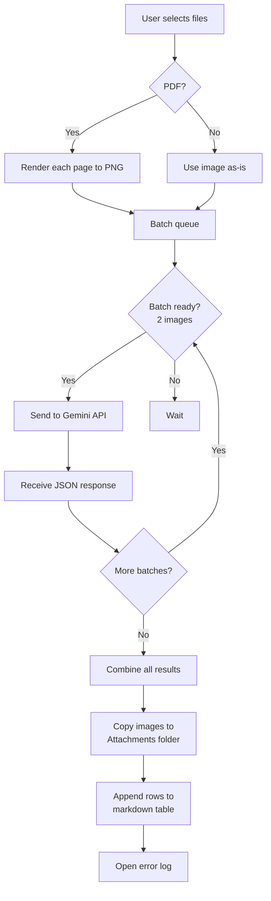

# Error Log Writer - Obsidian Plugin

> **AI-powered CPA exam error log creator** -- Transform your CPA review questions into structured error logs using Google Gemini Vision.

---

## Overview

This plugin lets you create **error logs** (오답노트) from CPA review materials directly within Obsidian. Simply select an image or PDF of a practice question, and the plugin will:

1. Analyze the content using **Google Gemini Vision AI**
2. Extract problems, answers, and detailed solutions
3. Save everything into a well-structured markdown table in your vault

---

## Pipeline Overview

Here is the complete workflow from the moment you click the plugin icon to the final error log:

```
user action
      |
      v
[1] Click Brain Icon (Ctrl/Cmd+O)
      |
      v
[2] Select Target Error Log File (where results are saved)
      |
      v
[3] Choose Action
  |-- Create Error Log  -->  [4a] Select Images/PDFs  -->  Process Pipeline
  |-- Fix Table Format  -->  [4b] Fix Existing Table   -->  Update in Place
      |
      v
[4a] Image/PDF Selection Modal
      |
      v
[4.5] Pre-Analysis (NEW) -- Extract answers/explanations, determine parse target
      |
      v
[5] Preprocessing -- Convert PDFs to Images (high-res PNG)
      |
      v
[6] Batch Analysis -- Send images to Gemini AI with pre-analysis context
      |         (2 images per request)
      |
      v
[7] Extract Problems -- AI identifies questions, answers, solutions
      |         (using pre-analysis answers as context)
      |
      v
[8] Save to Markdown -- Copy images to Attachments folder, write table
      |
      v
[9] Open Result -- Auto-open the error log for review
```

---

## Detailed Pipeline Steps

### Step 1: Trigger the Plugin

Click the **brain-circuit ribbon icon** in Obsidian, or use the command palette (`Ctrl/Cmd+P` --> "Error Log Writer: Create Error Log").

### Step 2: Select Target File

Choose the markdown file where your error log will be saved (e.g., `CPA_Error_Log.md`). If it does not exist, the plugin creates it automatically.

### Step 3: Choose Action

| Action | Description |
|---|---|
| **Create Error Log** | Select new images/PDFs to analyze |
| **Fix Table Formatting** | Repair a broken markdown table structure |

### Step 4: Select Source Files

Choose one or more image files (PNG, JPG) or PDF files from:

- **Internal Vault**: Files already in your Obsidian vault
- **External Folder**: A folder outside your vault (e.g., your CPA review software export)

### Step 4.5: Pre-Analysis (NEW)

Before preprocessing, the plugin performs a **Pre-Analysis** step using Gemini Vision for **PDF files only**. This step analyzes PDF pages as a unified sequential page stream to extract answers, explanations, and determine the parse target.

**Key Features:**

| Feature | Description |
|---|---|
| **PDF-Only Analysis** | Only PDF files are sent to pre-analysis. Standalone images bypass this step and go directly to batch analysis. |
| **Answer Extraction** | Extracts answer keys if present (e.g., "1.A 2.B 3.C") |
| **Explanation Extraction** | Extracts Korean explanations (keeps in Korean, allows English for key terms) |
| **Parse Target Detection** | Determines if pages contain questions, explanations, or both |
| **Progress Tracking** | Returns `done`/`remaining` page indices to skip already-processed pages in subsequent steps |

**Input:** Raw binary data from PDF files only (no text extraction first)

**Output Example:**
```json
{
  "answers": [{"number": "1", "answer": "A"}, {"number": "2", "answer": "B"}],
  "parseTarget": "explanation-pages",
  "processedContent": [...],
  "progressStatus": {"done": [0, 1], "remaining": [2, 3, 4], "description": "question pages"}
}
```

**How It Works:**

1. **Only PDFs are analyzed** -- Standalone images bypass pre-analysis entirely
2. **Sequential page numbering** -- PDF pages are numbered 0, 1, 2, ... across all PDFs
3. **Progress tracking** -- The API returns which pages are "done" (processed) and which are "remaining" (need batch analysis)
4. **Fallback on failure** -- If pre-analysis fails, the plugin silently continues with original behavior (all PDFs rendered to images)

> **Why Pre-Analysis?** This step enables subsequent Batch Analysis to use extracted answers as context, improving accuracy and enabling smarter question processing.

### Step 5: Preprocessing

The plugin prepares your files for AI analysis:

| File Type | Action |
|---|---|
| **Images** | Sent directly to AI |
| **PDFs** | Each page is rendered to a high-quality PNG image (4x scale) |

> **Note:** PDFs are converted to images page-by-page to preserve math formulas, diagrams, and Korean text.

### Step 6: Batch Analysis via Gemini AI

Images are sent to Google Gemini in batches of 2 for efficient API usage:

1. Each image is encoded as base64
2. A batch request is sent with the prompt **enhanced with Pre-Analysis context**:
   - `# answers for each question: 1.A, 2.B, 3.C...` (if answers were extracted)
   - `# Translated Explanations:` (if explanations were found)
3. The AI returns JSON with problem data (subject, number, solution, answer)
4. A 3-second cooldown is applied between batches to respect rate limits

**Context Format Example:**
```
Pre-Analysis Context:
# answers for each question: 1.A, 2.B, 3.C, 4.D
# Translated Explanations:
Q1: The correct answer is A because... [English translation]

---
[Original Batch Prompt]
```

```
Image Batch 1  -->  Gemini API + Context  -->  JSON Results (Problems 1-5)
Image Batch 2  -->  Gemini API + Context  -->  JSON Results (Problems 6-10)
Image Batch 3  -->  Gemini API + Context  -->  JSON Results (Problems 11-12)
     |
     v
Combined Results (all problems merged)
```

### Step 7: Problem Extraction

For each image, the AI extracts:

| Field | Description |
|---|---|
| `subject` | Subject and topic (e.g., "재무회계 > 재고자산") |
| `number` | Problem number (e.g., "41번") |
| `solution` | Detailed step-by-step Korean explanation |
| `answer` | The correct answer with emphasis |
| `image_index` | Reference to the source image |

### Step 8: Save to Markdown

The results are saved as a structured markdown table:

| 과목 | 문제 | 정답 | 풀이 | 비고 |
|:---:|:---|:---|:---|:---|
| 재무회계 | ![[attachment.png]] | 41. **A** | 단계별 풀이... | |

- Images are copied to the **Attachments folder** (default: `CPA_Attachments`)
- External image files are deleted after copying
- New rows are **appended** to the existing error log
- The file is configured with `cpa-log` CSS class for styling

### Step 9: Open Result

The error log is automatically opened in a new tab for review.

---

## Alternative: Fix Table Formatting

If your error log table has structural issues (misaligned columns, missing separators), use the **Fix Table Formatting** action:

1. The plugin reads the current table content
2. Sends it to Gemini AI for structure repair
3. Replaces the broken table with a corrected version

Supported fixes:

- Column count mismatches
- Missing separator rows (`|---|`)
- Line breaks split across multiple lines
- Unescaped pipe characters (`|`)
- Missing empty cells

---

## Configuration

Open plugin settings via: **Settings --> Community Plugins --> Error Log Writer**

| Setting | Default | Description |
|---|---|---|
| **Gemini API Key** | (required) | Your Google AI Studio API key |
| **Gemini Model** | `gemini-2.0-flash` | AI model to use |
| **Attachment Folder** | `CPA_Attachments` | Vault folder for image attachments |
| **Default Input Folder** | (set manually) | External folder to source images from |
| **Debug Log Path** | `CPA_Debug_Log.md` | Path for debug output |

---

## Data Flow Diagram



---

## Prerequisites

- **Obsidian** v0.15.0 or later
- **macOS** (folder selection uses macOS-native dialog)
- **Google AI API Key** (get one at https://aistudio.google.com/apikey)
- Desktop version (not mobile)

---

## Installation

### Manual Installation

1. Download the latest release files
2. Copy to your vault's plugins folder: `.obsidian/plugins/obsidian-error-log-writer/`
3. Enable the plugin in: **Settings --> Community Plugins --> Browse --> Error Log Writer**

### From Source

```bash
git clone https://github.com/3always8/obsidian-error-log-writer.git
cd obsidian-error-log-writer
npm install
npm run build
```

Copy the built files (`main.js`, `manifest.json`, `styles.css`) to your vault's plugin directory.

---

## File Structure

```
error-log-writer/
CPA_Attachments/         # Processed image attachments
docs/
output/                  # Debug output directory
src/
  main.ts                # Plugin entry point & orchestration
  modals.ts              # UI modal components
  prompts.ts             # AI prompt templates
  settings.ts            # Settings tab
  types.ts               # TypeScript type definitions
  adapters/              # Adapter implementations
  services/
    llm-service.ts       # Gemini API communication
    pdf-service.ts       # PDF-to-image conversion
    markdown-service.ts  # Markdown file operations
    table-service.ts     # Table structure fixing
  utils/
    logger.ts            # Debug logging
```

---

## Troubleshooting

| Issue | Solution |
|---|---|
| "API Key Required" | Set your Gemini API Key in plugin settings |
| "No problems extracted" | Try a different image or check if text is readable |
| "PDF 변환 실패" | Ensure the PDF is not password-protected |
| Table looks broken | Use "Fix Table Formatting" action |
| Slow processing | Reduce batch size or use simpler images |

---

## License

0-BSD

---

## Author

**3always8** -- [GitHub](https://github.com/3always8)
